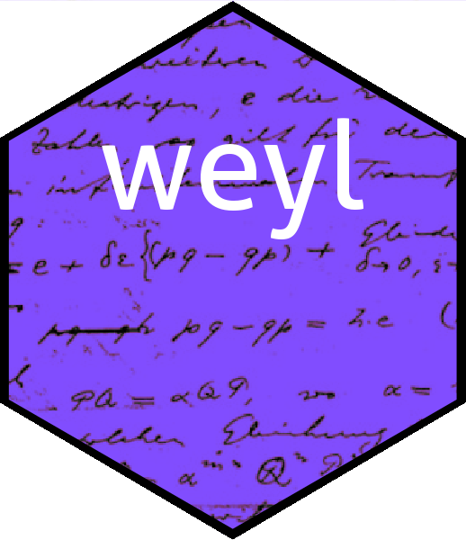

Weyl algebra in R
================

<!-- README.md is generated from README.Rmd. Please edit that file -->



The `weyl` package provides R-centric functionality for working with
Weyl algebras of arbitrary dimension. A detailed vignette is provided in
the package.

# Installation

You can install the released version of the weyl package from
[CRAN](https://CRAN.R-project.org) with:

``` r
# install.packages("weyl")  # uncomment this to install the package
library("weyl")
set.seed(0)
```

The Weyl algebra is a noncommutative algebra which is used in quantum
mechanics and the theory of differential equations (Coutinho 1997). The
`weyl` package offers a consistent and documented suite of R-centric
software. It is based on the `spray` package for sparse arrays which
confers computational efficiency.

# The `weyl` package in use

The basic creation function is `weyl()`, which takes a `spray` object
and returns a member of the Weyl algebra.

``` r
S <- spray(rbind(c(1,0,0,1,1,0),c(0,1,1,3,2,0)) ,1:2)
S
#>                  val
#>  0 1 1 3 2 0  =    2
#>  1 0 0 1 1 0  =    1
```

Above, object `S` is a standard `spray` object but to work with Weyl
algebra we need to coerce it to a `weyl` object with `weyl()`:

``` r
W <- weyl(S)
W
#> A member of the Weyl algebra:
#>   x  y  z dx dy dz     val
#>   0  1  1  3  2  0  =    2
#>   1  0  0  1  1  0  =    1
```

Above, object `W` is a member of the third Weyl algebra: that is, the
algebra generated by
.
In this case
.
In other words
.

We might ask what 
is, and this is easy in the package:

``` r
Wsquared <- W*W
Wsquared
#> A member of the Weyl algebra:
#>   x  y  z dx dy dz     val
#>   0  2  2  6  4  0  =    4
#>   0  1  2  6  3  0  =    8
#>   0  1  1  3  3  0  =    6
#>   1  1  1  4  3  0  =    4
#>   2  0  0  2  2  0  =    1
#>   1  0  1  4  2  0  =    2
#>   1  0  0  1  2  0  =    1
```

This is a more complicated operator. However, we might wish to display
it in symbolic form:

``` r
options(polyform=TRUE)
Wsquared
#> A member of the Weyl algebra:
#> +4*y^2*z^2*dx^6*dy^4 +8*y*z^2*dx^6*dy^3 +6*y*z*dx^3*dy^3
#> +4*x*y*z*dx^4*dy^3 +x^2*dx^2*dy^2 +2*x*z*dx^4*dy^2 +x*dx*dy^2
```

## References

-   S. C. Coutinho 1997. *The many avatars of a simple algebra*. The
    American Mathematical Monthly, 104(7):593-604. DOI
    <https://doi.org/10.1080/00029890.1997.11990687>.

# Further information

For more detail, see the package vignette

`vignette("clifford")`
